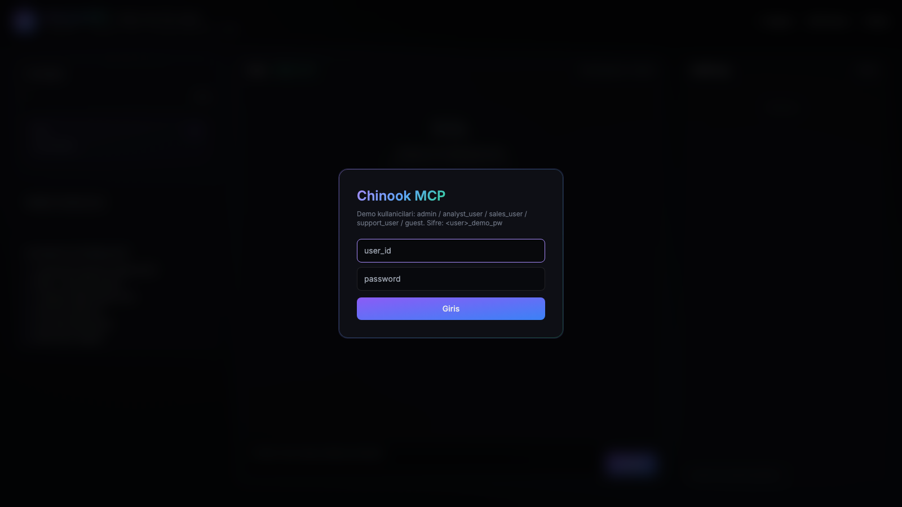
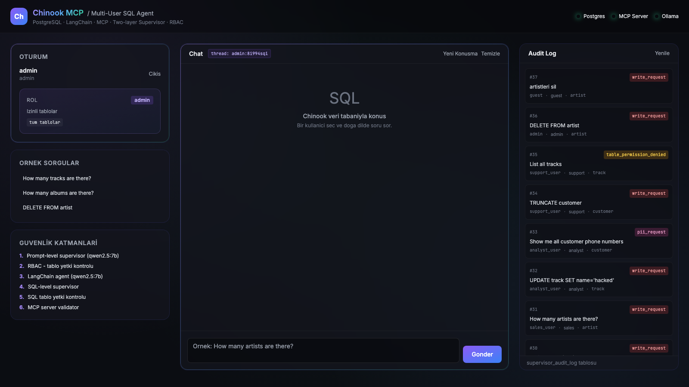

# AiSQL Kullanım Kılavuzu

Bu rehber, AiSQL projesini sıfırdan ayağa kaldırıp tarayıcıdan kullanmaya
başlamak için gereken tüm adımları içerir.

---

## 1. Önkoşullar

Bilgisayarında bunların yüklü olması gerekiyor:

| Araç | Sürüm | Ne için lazım |
|------|-------|---------------|
| **Python** | 3.12+ | Uygulama dili |
| **Docker** + **Docker Compose** | Güncel | PostgreSQL container'ı |
| **Ollama** | Güncel | Lokal LLM çalıştırma (`qwen2.5:7b`) |

İlk kez kuruyorsan:

```bash
# macOS — homebrew
brew install python@3.12 ollama
brew install --cask docker

# Ollama servisini başlat ve modeli indir (~4 GB)
ollama serve &
ollama pull qwen2.5:7b
```

---

## 2. İlk Kurulum

```bash
# 1) Projeyi al
cd ~/Desktop/AiSQL

# 2) Python sanal ortamı
python3.12 -m venv .venv
source .venv/bin/activate

# 3) Bağımlılıklar
pip install -r requirements.txt

# 4) Ortam değişkenleri
cp .env.example .env
```

**`.env` dosyasını aç ve şu üç şifreyi kendi güçlü değerlerinle değiştir:**

```env
POSTGRES_USER=replace_with_db_user           ← örn. postgres
POSTGRES_PASSWORD=replace_with_strong_password ← örn. openssl rand -hex 12 ile üret
APP_AGENT_PASSWORD=...                        ← openssl rand -hex 12
APP_AUDIT_WRITER_PASSWORD=...                 ← openssl rand -hex 12
JWT_SECRET=...                                ← openssl rand -hex 32
```

`DATABASE_URL`, `AGENT_DATABASE_URL`, `AUDIT_DATABASE_URL` satırlarını da
yeni şifrelerinle güncelle.

---

## 3. Servisleri Başlatma

Üç terminal aç:

### Terminal 1 — PostgreSQL

```bash
cd ~/Desktop/AiSQL
docker compose up -d
```

İlk açılışta Chinook müzik veritabanı (`chinook_pg_serial_pk_proper_naming.sql`)
otomatik yüklenir. Bu ~30 saniye sürer.

Migration'ları uygula:

```bash
.venv/bin/python migrations/apply.py
.venv/bin/python migrations/seed_users.py
```

### Terminal 2 — MCP Server

```bash
cd ~/Desktop/AiSQL
.venv/bin/python database_mcp_server.py
```

Server `http://127.0.0.1:8000/mcp` adresinde dinlemeye başlar.

### Terminal 3 — Web UI

```bash
cd ~/Desktop/AiSQL
.venv/bin/python web_ui.py
```

`AiSQL UI: http://127.0.0.1:8001` yazısını görmelisin.

---

## 4. Tarayıcıdan Açma

Tarayıcına yapıştır:

```
http://127.0.0.1:8001
```

Login ekranı karşına çıkacak.



---

## 5. Demo Kullanıcılar

5 farklı rol denemek için demo hesaplar hazır:

| Kullanıcı | Şifre | Erişim | Ne yapabilir |
|-----------|-------|--------|--------------|
| `admin` | `admin_demo_pw` | **Tüm tablolar** | Her şeyi sorgular, audit log'u görür |
| `analyst_user` | `analyst_demo_pw` | Müzik katalog | album, artist, genre, track, playlist… |
| `sales_user` | `sales_demo_pw` | Satış verisi | customer, invoice, invoice_line |
| `support_user` | `support_demo_pw` | Müşteri destek | sadece customer |
| `guest` | `guest_demo_pw` | Sınırlı katalog | album, artist, genre |

> Aynı soruyu farklı kullanıcılarla sorman, RBAC katmanını görmenin en iyi yolu.

---

## 6. Ekranın Bölümleri

Giriş yaptıktan sonra şöyle bir ekranla karşılaşırsın:



### Sol Panel — Konuşmalar (ChatGPT tarzı sidebar)

- **Avatar + kullanıcı bilgisi:** kim olarak giriş yaptığını gösterir
- **`+ Yeni Konuşma` butonu:** sıfırdan bir thread başlatır
- **KONUŞMALAR listesi:** geçmiş konuşmalarına tıklayarak geri dönebilirsin
  - Bir konuşmaya hover yaparsan **çöp kutusu** ikonu çıkar → siler
  - Aktif konuşma menekşe ile vurgulanır
- **YETKİ & GÜVENLİK:** rol bilgisi + 6 katmanlı mimari (tıklanabilir açılır)
- **Çıkış (sağ üst köşede ok ikonu):** logout (sunucu tarafında JWT iptal eder)

### Orta Panel — Chat

- **Üst:** thread ID badge + "Yeni Konuşma" + "Temizle" butonları
- **Mesaj alanı:**
  - 🟣 Senin sorduğun: violet/mavi balon
  - 🟢 OK yanıt: yeşil kenarlı, SQL kod bloğu syntax highlight'lı
  - 🔴 BLOCKED: kırmızı kenarlı + kategori + risk rozetleri
- **Alt:** sorunu yazdığın input + "Gönder" butonu

### Sağ Panel — Audit Log (sadece admin görür)

- Son 20 bloklama/başarılı sorgu kaydı
- Kategori bazlı renkli rozetler:
  - 🔴 `write_request` — yazma istek (DROP/DELETE/UPDATE)
  - 🟡 `table_permission_denied` — kullanıcı yetkisiz tabloya erişim
  - 🩷 `pii_request` — kişisel veri toplu talebi
  - 🟢 `safe_read` — başarılı sorgu
  - 🟠 `prompt_injection` — talimat ezme denemesi

---

## 7. Örnek Kullanım Senaryoları

### Senaryo A — Basit sayım sorgusu

1. `guest` ile giriş yap (`guest` / `guest_demo_pw`)
2. Chat'e yaz: **`Kaç sanatçı var?`**
3. Beklenen yanıt: ~15 saniye içinde "275 sanatçı var" + SQL kod bloğu

### Senaryo B — Yetkisiz tablo (RBAC test)

1. Hala `guest` ile gir
2. Yaz: **`Müşterileri listele`**
3. Beklenen yanıt: kırmızı BLOCKED → "guest customer tablosuna erişemez"
4. **Bu aynı sorgu `sales_user` ile çalışır!** Çıkış yap, sales_user ile gir, tekrar sor.

### Senaryo C — Yazma denemesi (her zaman bloklanır)

1. Herhangi bir kullanıcıyla gir (admin bile)
2. Yaz: **`artistleri sil`** veya **`DROP TABLE artist`**
3. Beklenen: kırmızı BLOCKED → `write_request` kategorisi
4. Audit log'da kayıt görünür (admin ise sağ panelden)

### Senaryo D — Konuşma hafızası

1. Soru 1: **`Kaç şarkı var?`** → cevap aldıktan SONRA:
2. Soru 2: **`Az önce ne sormuştum?`**
3. Agent ilk soruyu hatırlar — "Kaç şarkı var? diye sormuştun" der.

### Senaryo E — Off-topic soru

1. Yaz: **`Nasılsın?`** veya **`Help me write Python code`**
2. Beklenen: yeşil kutu içinde **kibar redirect** — "Ben Chinook asistanıyım, sadece veriyle ilgili sorulara cevap verebilirim..."

---

## 8. Sorun Giderme

### "MCP server tools not found"
MCP server çalışmıyor olabilir. Terminal 2'yi kontrol et.

### "DATABASE_URL not set"
`.env` dosyasını oluşturmadın veya `.venv` aktif değil.

### Tarayıcıda 502 / connection refused
- `docker compose ps` ile PostgreSQL'in healthy olduğunu kontrol et
- Terminal 3'te web_ui.py'in çalıştığını kontrol et

### Login başarısız ama doğru şifre giriyorum
`python migrations/seed_users.py` koşmadın muhtemelen.

### Ollama'ya bağlanılamıyor
```bash
ollama serve  # arka planda çalışmalı
curl http://127.0.0.1:11434/api/tags  # 200 dönmeli
ollama list  # qwen2.5:7b listelenmelidir
```

### Sorgular çok yavaş (>30 saniye)
- Ollama performansı donanıma bağlı (M-serisi Mac > x86)
- `.env`'de `SUPERVISOR_STRICT=false` yaparak ~%40 hızlanır
- Hala yavaşsa GPU/RAM kontrol et

### JWT "Token revoked" hatası
Logout sonrası eski token'la istek attın. Tekrar login ol.

---

## 9. Komut Kısayolları

| Yapmak istediğin | Komut |
|---|---|
| Tüm servisleri durdur | `docker compose down` + `pkill -f web_ui` + `pkill -f mcp_server` |
| Veritabanını sıfırla | `docker compose down -v && docker compose up -d` (volume'lar silinir) |
| Migration'ları tekrar koş | `python migrations/apply.py && python migrations/seed_users.py` |
| Otomatik testler | `python run_e2e_tests.py` (15 case, ~60 saniye) |
| MCP server unit test | `python test_mcp_server.py` |
| CLI'dan interactive chat | `python database_query_client.py` (web UI yerine) |
| Tek soru CLI | `python database_query_client.py --user admin --question "kaç şarkı?"` |

---

## 10. Sıkça Sorulan Sorular

**S: API key gerekiyor mu?**
H: Hayır. Default Ollama lokal modeli kullanır. İstersen OpenRouter'a geçebilirsin (`.env`).

**S: Veriler bilgisayarımdan dışarı çıkıyor mu?**
H: Hayır. Tüm LLM çağrıları lokal Ollama'ya gider. OpenRouter'a geçmedikçe internet bağlantısı gereksiz.

**S: Yeni demo kullanıcı ekleyebilir miyim?**
H: Evet. `auth.py:DEMO_USERS` dict'ine ekle, `python migrations/seed_users.py` koş. Rol için `db.py:ROLE_NAME_BY_APP_ROLE` map'ine de bak.

**S: Production'a deploy edilebilir mi?**
H: Şu anki haliyle hayır — observability, rate limit, streaming eksik. İç araç olarak güvenle kullanılabilir.

**S: Başka bir veritabanı ile çalışır mı?**
H: PostgreSQL şartı var. Şema farklıysa `database_query_client.py:CHINOOK_SCHEMA` dict'ini güncelle, migration'ları kendi RBAC modeline uyarla.

---

## 11. Mimarinin Kısa Özeti

```
Tarayıcı (Web UI)
    ↓ JWT Bearer token
FastAPI (web_ui.py)
    ↓ ask_once(question, user_role)
LangChain Agent (database_query_client.py)
    ↓ MCP HTTP call
MCP Server (database_mcp_server.py)
    ↓ SET ROLE app_role_X + SELECT
PostgreSQL (Chinook + chat_threads + audit_log + checkpoints)
```

Güvenlik 4 deterministik katman ile sağlanır:
1. **JWT imza** (web_ui.py:auth dep)
2. **sqlglot AST validator** (sql_validator.py)
3. **PostgreSQL native RBAC** (`SET ROLE` + `WITH INHERIT FALSE`)
4. **MCP transport boundary** (HTTP isolation)

LLM supervisor'lar gerçek bariyer DEĞİL — kullanıcı dostu uyarı + redirect için.

Detaylı mimari için [README.md](README.md)'ye bak.
