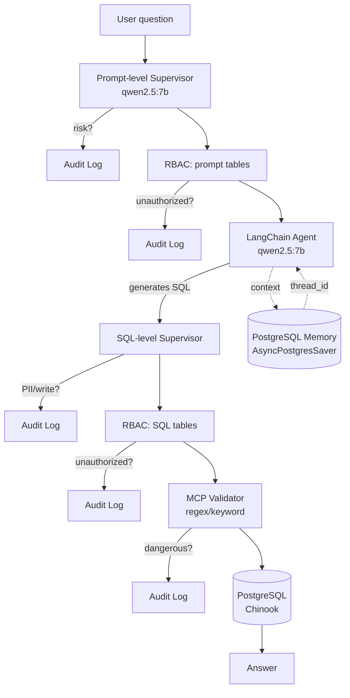

# AiSQL — Multi-Layered Secure SQL Agent

A Model Context Protocol (MCP) project that turns natural language into SQL,
hardened with a **two-layer LLM supervisor**, **role-based table access
control (RBAC)**, and **PostgreSQL-backed conversation memory**.

[](https://www.python.org/)
[](https://www.postgresql.org/)
[](https://www.langchain.com/)
[](https://fastapi.tiangolo.com/)
[](https://www.docker.com/)
[](LICENSE)


> Türkçe sürüm: [README.md](README.md)

---

## Highlights

| | |
|---|---|
| **MCP Server** | 7 tools over `streamable-http` on port 8000 |
| **MCP Client** | LangChain agent + `langchain-mcp-adapters` for remote tool calls |
| **Two-layer Supervisor** | Local `qwen2.5:7b` runs at both prompt and SQL level |
| **RBAC** | 5 roles × table permissions, enforced at prompt and SQL |
| **Conversation Memory** | LangGraph `AsyncPostgresSaver`, thread-isolated history |
| **Audit Log** | Every blocked request persisted to PostgreSQL with full context |
| **Web UI** | FastAPI + Tailwind, dark theme, live audit log |
| **Local LLM** | Runs offline with Ollama (`qwen2.5:7b`), no API key required |
| **End-to-end Tests** | 15-case runner, programmatic report generation |

---

## Quickstart

### Prerequisites

- Python 3.12+
- Docker + Docker Compose
- [Ollama](https://ollama.com/) with the `qwen2.5:7b` model

### Install

```bash
python3.12 -m venv .venv
source .venv/bin/activate
pip install -r requirements.txt

cp .env.example .env
# Edit .env: replace POSTGRES_USER/PASSWORD/DATABASE_URL placeholders

ollama pull qwen2.5:7b
ollama serve   # background
```

### Run

```bash
# 1) Database
docker compose up -d

# 2) MCP Server
python database_mcp_server.py

# 3) Pick one:
python web_ui.py                     # Web UI → http://127.0.0.1:8001
python database_query_client.py      # Interactive CLI
python run_e2e_tests.py              # 15-case automated tests
```

---

## Architecture



Unlike a monolithic SQL agent, the client never touches the database directly.
The MCP server exposes tools over HTTP, and the client invokes them remotely
by name.

---

## Security Layers

Every user request flows through 6 layers. Any layer can stop the request and
write to the audit log.

| # | Layer | Purpose |
|---|-------|---------|
| 1 | Prompt-level supervisor | Catches write intent, PII requests, prompt injection |
| 2 | Prompt RBAC | Table permission check including Turkish aliases (`artistleri` → `artist`) |
| 3 | LangChain agent | Generates SQL, calls MCP tools |
| 4 | SQL-level supervisor | Inspects the generated SQL one more time |
| 5 | SQL RBAC | Tables in `FROM`/`JOIN` checked against the user's role (CTEs excluded) |
| 6 | MCP server validator | Rule-based regex/keyword filter |

**Examples that are rejected:**

```sql
DROP TABLE artist;                          -- layer 1, 4, or 6
DELETE FROM track;                          -- layer 1, 4, or 6
SELECT * FROM artist; DROP TABLE album;     -- layer 6 (multi-statement)
SELECT * FROM artist FOR UPDATE;            -- layer 6 (locking)
```

**Fail-closed mode:** When `SUPERVISOR_FAIL_CLOSED=true`, the query will **not**
run if the supervisor is unreachable.

---

## Demo Users

| User | Role | Allowed Tables |
|------|------|----------------|
| `admin` | admin | all tables |
| `analyst_user` | analyst | album, artist, genre, media_type, playlist, playlist_track, track |
| `sales_user` | sales | customer, invoice, invoice_line |
| `support_user` | support | customer |
| `guest` | guest | album, artist, genre |

The same question yields different results depending on the user. For example,
`"How many customers are there?"`:

- `sales_user` → answer: 59
- `guest` → blocked (`table_permission_denied`)

---

## MCP Tools

The server exposes 7 tools:

| Tool | Purpose |
|------|---------|
| `list_tables` | List public-schema tables |
| `get_table_schema` | Return column names, types, nullability |
| `validate_query` | Static safety check without execution |
| `execute_query` | Execute a safe SELECT (max 50 rows, 5s timeout) |
| `get_database_info` | Database metadata |
| `log_security_event` | Persist a supervisor decision to the audit log |
| `get_security_events` | Read recent audit log entries |

Before `execute_query` runs the actual SQL it rejects:
1. Empty queries
2. SQL comments (`--`, `/* */`)
3. Multi-statement input (`;`)
4. Anything that doesn't start with `SELECT`
5. Write keywords (DROP/DELETE/UPDATE/...)
6. Locking clauses (`FOR UPDATE/SHARE`)

It also sets PostgreSQL `statement_timeout` to 5 seconds per call.

---

## Conversation Memory

Using LangGraph's `AsyncPostgresSaver`, the agent remembers prior turns within
the same `thread_id`:

```
Turn 1: "How many artists are there?"
        → 275 artists. (SQL: SELECT COUNT(*) FROM artist)
Turn 2: "What was my previous question?"
        → "How many artists are there?"  ✓ remembered
```

Auto-created tables: `checkpoints`, `checkpoint_blobs`, `checkpoint_writes`,
`checkpoint_migrations`.

**Thread isolation:** Different `thread_id`s never share context. The Web UI
assigns each user their own thread; the "New Conversation" button starts a
fresh thread.

**Disable:** set `MEMORY_ENABLED=false` in `.env`.

---

## Web UI

Single-file SPA built with FastAPI + Tailwind CDN (`web_ui.py`).

**Endpoints:**

```text
GET  /            # main page
GET  /api/users   # user list + table permissions
POST /api/ask     # { user, question, thread_id } → agent response
GET  /api/audit   # recent audit-log rows
GET  /api/health  # health probe
```

**Panel layout:**
- **Left:** user picker, role card, example queries, security stack
- **Center:** chat — `OK` green border + SQL highlight, `BLOCKED` red border + category/risk badges
- **Right:** live audit log — `write_request` red, `pii_request` pink, `table_permission_denied` amber

---

## Testing

### MCP Server Unit Tests

```bash
python test_mcp_server.py
```

10 assertions: tool discovery, list_tables, get_table_schema, validate_query
(safe + dangerous), execute_query (SELECT + DELETE rejection),
get_database_info, log_security_event, get_security_events.

### End-to-End Test Runner

```bash
python run_e2e_tests.py
```

15 cases (9 forbidden + 6 allowed) across 5 users, with audit-log verification
and automatic report generation (`docs/e2e_test_results.txt`).

**Latest run:**

| Metric | Value |
|--------|-------|
| MCP server tests | PASSED |
| Forbidden blocked | 9/9 |
| Allowed answered | 6/6 |
| New audit rows | 9 |
| Total duration | ~66 seconds |

---

## File Layout

```
.
├── database_mcp_server.py          # MCP server, 7 tools, query validator
├── database_query_client.py        # LangChain agent + supervisor + RBAC + memory
├── web_ui.py                       # FastAPI + Tailwind web UI
├── run_e2e_tests.py                # 15-case test runner
├── test_mcp_server.py              # MCP server unit tests
│
├── docker-compose.yml              # PostgreSQL 16 container
├── chinook_pg_serial_pk_proper_naming.sql  # Chinook init script
├── requirements.txt                # Python dependencies
├── .env.example                    # Env template (placeholders only)
├── .gitignore
│
├── docs/
│   ├── ui-screenshot.png
│   ├── ui-login.png
│   ├── ui-loggedin-*.png
│   └── e2e_test_results.txt
│
├── README.md                       # Turkish version
├── README.en.md                    # This file
├── KULLANIM_KILAVUZU.md            # User guide (TR)
└── LICENSE
```

---

## Known Limitations

Because this project runs on a local LLM (`qwen2.5:14b` via Ollama), the
model itself introduces a few behavioural quirks. The security layers
(JWT, sqlglot AST, PostgreSQL RBAC, MCP) are **unaffected** — only the
naturalness of the final answer is.

- **Admin PII listing**: Even though the `admin` role can read every
  table, the model may conservatively refuse broad PII queries such as
  "list customer emails". The agent prompt softens this (`HARD RULE 2`),
  but the model's intrinsic refusal bias can't always be fully overcome.
  Operators can fall back to direct `psql`.
- **Large listing queries**: The model sometimes auto-appends `LIMIT 50`
  and runs the query, and sometimes asks the user to narrow the request.
  This is model variance, not a data-safety issue.
- **Language consistency**: `qwen2.5:14b` may occasionally inject a few
  foreign characters into Turkish replies (mostly suppressed by a strict
  system-prompt rule). For more consistent language behaviour, switch
  to `qwen2.5:7b` or a stronger model (Claude, GPT-4).
- **Off-topic questions**: The model may briefly answer something like
  "the capital of France" and then politely redirect with "this database
  doesn't contain that". This is cosmetic — security is untouched.

These limitations largely disappear with a **stronger model**
(`claude-sonnet-4` or `gpt-4`); the architecture and APIs remain the
same.

---

## License

[MIT](LICENSE)
