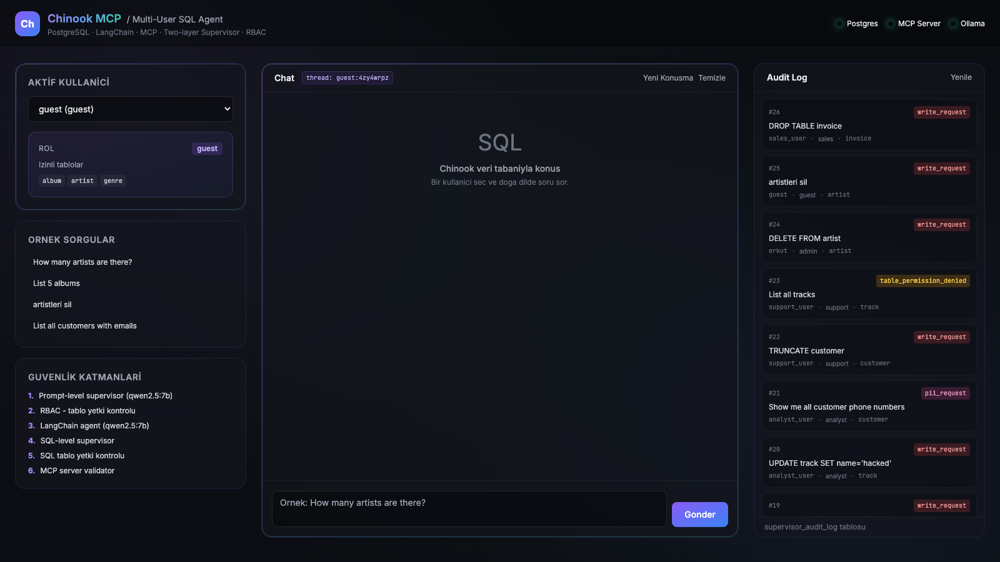
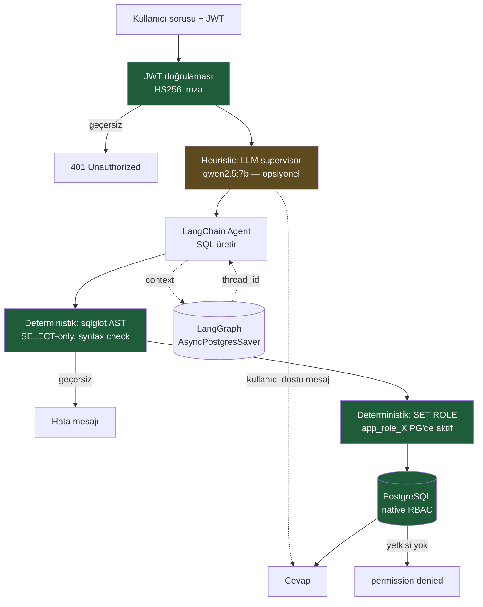

# AiSQL — Çok Katmanlı Güvenli SQL Agent

Doğal dilden SQL üreten, **iki katmanlı LLM denetçisi**, **rol bazlı tablo
yetkilendirmesi (RBAC)** ve **PostgreSQL tabanlı konuşma hafızası** ile
güçlendirilmiş bir Model Context Protocol (MCP) projesi.

[](https://www.python.org/)
[](https://www.postgresql.org/)
[](https://www.langchain.com/)
[](https://fastapi.tiangolo.com/)
[](https://www.docker.com/)
[](LICENSE)



---

## İçindekiler

- [Özellikler](#özellikler)
- [Hızlı Başlangıç](#hızlı-başlangıç)
- [Mimari](#mimari)
- [Güvenlik Katmanları](#güvenlik-katmanları)
- [Demo Kullanıcılar](#demo-kullanıcılar)
- [MCP Tool'ları](#mcp-toolları)
- [Konuşma Hafızası](#konuşma-hafızası)
- [Web UI](#web-ui)
- [Test](#test)
- [Dosya Yapısı](#dosya-yapısı)

---

## Özellikler

| | |
|---|---|
| **MCP Server** | FastMCP üzerinde 7 tool, `streamable-http` transport, port 8000 |
| **MCP Client** | LangChain agent + `langchain-mcp-adapters` ile tool çağrısı |
| **İki Katmanlı Supervisor** | Prompt-level ve SQL-level lokal `qwen2.5:7b` denetçi |
| **RBAC** | 5 rol × tablo yetkilendirmesi, prompt + SQL'de iki kez kontrol |
| **Konuşma Hafızası** | LangGraph `AsyncPostgresSaver`, thread bazlı izole geçmiş |
| **Audit Log** | Tüm bloklanan istekler PostgreSQL'e detaylı kayıt |
| **Web UI** | FastAPI + Tailwind, dark tema, canlı audit log |
| **Lokal LLM** | API key gerektirmeyen Ollama (`qwen2.5:7b`) |
| **Otomatik Test** | 15 case'lik uçtan uca runner, programatik rapor üretimi |

---

## Hızlı Başlangıç

### Önkoşullar

- Python 3.12+
- Docker + Docker Compose
- [Ollama](https://ollama.com/) (`qwen2.5:7b` modeli)

### Kurulum

```bash
# Bağımlılıklar
python3.12 -m venv .venv
source .venv/bin/activate
pip install -r requirements.txt

# Env hazırla (placeholder'ları gerçek değerlerle değiştir)
cp .env.example .env

# Ollama
ollama pull qwen2.5:7b
ollama serve   # arka planda
```

### Çalıştır

```bash
# 1) Database
docker compose up -d

# 2) MCP Server
python database_mcp_server.py

# 3) Aşağıdakilerden istediğini seç:
python web_ui.py                     # Web UI → http://127.0.0.1:8001
python database_query_client.py      # Interactive CLI
python run_e2e_tests.py              # 15 case'lik otomatik test
```

---

## Mimari

İstek 4 katmandan geçer. Gerçek güvenlik bariyerleri **deterministik**'tir
(JWT imzası, sqlglot AST, PostgreSQL native RBAC). LLM supervisor bir
**UX/heuristic** katmanıdır — bypass edilse bile alttaki deterministik
katmanlar sorguyu zaten reddeder.


```

Geleneksel monolitik mimariden ayrılan ana fark: client database'e doğrudan
bağlanmaz. MCP server tool'ları HTTP üzerinden dışarı açar, client tool
isimlerine göre uzaktan çağırır.

---

## Güvenlik Katmanları

Sistem **3 deterministik bariyer + 1 heuristic UX katmanı** ile çalışır.
Heuristic katman bypass edilse bile alttaki deterministik katmanlar
sorguyu reddeder; tersi geçerli değildir. "Gerçek güvenliği LLM sağlamıyor."

| # | Katman | Tip | Görevi |
|---|--------|-----|--------|
| 1 | JWT imza doğrulaması | **deterministik** | HS256 imzayla user_id ve role token'dan alınır, body'den değil — role spoof imkansız |
| 2 | LLM supervisor (opsiyonel) | heuristic | Yazma niyeti, PII talebi, prompt injection için kullanıcı dostu mesaj. `SUPERVISOR_STRICT=false` ile kapatılabilir |
| 3 | sqlglot AST validator | **deterministik** | Tek SELECT statement, no DDL/DML/locking. Regex değil gerçek parser |
| 4 | PostgreSQL native RBAC | **deterministik** | `SET ROLE app_role_X` + `WITH INHERIT FALSE` ile per-table SELECT. DROP/UPDATE/DELETE **fiziksel olarak imkansız** |

**Önemli:** Önceki sürümlerde "6 katmanlı" diye anlatılan model, application-level
RBAC ve LLM supervisor'ı ayrı katmanlar olarak sayıyordu. Phase 1 sonrası bunlar
deterministik DB katmanının önündeki **kullanıcı deneyimi (UX) yardımcıları** —
gerçek güvenlik bariyeri değil. Bu README dürüst framing'i yansıtır.

**Reddedilen örnekler ve hangi katman yakalar:**

```sql
DROP TABLE artist;                       -- 3 (sqlglot: write op detected)
DELETE FROM track;                       -- 3 (sqlglot)
SELECT * FROM customer (guest user);     -- 4 (PG: permission denied)
SELECT * FROM artist; DROP TABLE album;  -- 3 (sqlglot: multi-statement)
SELECT * FROM artist FOR UPDATE;         -- 3 (sqlglot: locking clause)
{"user":"admin"} body spoofu;            -- 1 (JWT mismatch)
```

**Fail-closed mod:** `SUPERVISOR_FAIL_CLOSED=true` iken LLM supervisor'a
erişilemezse sorgu çalıştırılmaz — heuristic katmanın belirsizliğinde temkinli
varsayılan.

---

## Demo Kullanıcılar

| Kullanıcı | Rol | İzinli Tablolar |
|-----------|-----|-----------------|
| `admin` | admin | tüm tablolar |
| `analyst_user` | analyst | album, artist, genre, media_type, playlist, playlist_track, track |
| `sales_user` | sales | customer, invoice, invoice_line |
| `support_user` | support | customer |
| `guest` | guest | album, artist, genre |

Aynı soru farklı kullanıcılarda farklı sonuç verir. Örneğin
`"How many customers are there?"`:

- `sales_user` → cevap: 59
- `guest` → bloklandı (`table_permission_denied`)

---

## MCP Tool'ları

Server tarafında 7 tool sunulur:

| Tool | Görev |
|------|-------|
| `list_tables` | public şemadaki tabloları listele |
| `get_table_schema` | tablo kolonlarını ve tiplerini döner |
| `validate_query` | sorguyu çalıştırmadan güvenlik kontrolü |
| `execute_query` | güvenli SELECT sorgusunu çalıştırır (max 50 satır, 5s timeout) |
| `get_database_info` | veritabanı meta bilgisi |
| `log_security_event` | supervisor kararını audit log'a yazar |
| `get_security_events` | audit log son kayıtları okur |

`execute_query` çalıştırmadan önce:
1. Boş sorgu reddedilir
2. SQL comment (`--`, `/* */`) reddedilir
3. Multi-statement (`;`) reddedilir
4. `SELECT` ile başlamayan reddedilir
5. Yazma keyword'leri (DROP/DELETE/UPDATE/...) reddedilir
6. Locking clause (`FOR UPDATE/SHARE`) reddedilir
7. PostgreSQL `statement_timeout` 5 saniyeye ayarlanır

---

## Konuşma Hafızası

LangGraph `AsyncPostgresSaver` ile agent, aynı `thread_id` içindeki sorular
arasında context'i hatırlar:

```
Turn 1: "How many artists are there?"
        → 275 artists. (SQL: SELECT COUNT(*) FROM artist)
Turn 2: "What was my previous question?"
        → "How many artists are there?"  ✓ hatırladı
```

Otomatik oluşturulan tablolar: `checkpoints`, `checkpoint_blobs`,
`checkpoint_writes`, `checkpoint_migrations`.

**Thread izolasyonu:** Farklı `thread_id`'ler birbirini görmez. Web UI her
kullanıcıya kendi thread'ini atar, "Yeni Konuşma" butonu yeni thread açar.

**Kapatmak için:** `.env` içinde `MEMORY_ENABLED=false`.

---

## Web UI

FastAPI + Tailwind CSS ile tek dosyalık SPA (`web_ui.py`).

**Endpoint'ler:**

```text
GET  /            # ana sayfa
GET  /api/users   # kullanıcı listesi + tablo yetkileri
POST /api/ask     # { user, question, thread_id } → agent cevabı
GET  /api/audit   # son audit log satırları
GET  /api/health  # sağlık kontrolü
```

**Panel yapısı:**
- **Sol:** kullanıcı seçici, rol kartı, örnek sorgular, güvenlik katmanları
- **Orta:** chat — `OK` yeşil çerçeve + SQL highlight, `BLOCKED` kırmızı çerçeve + kategori/risk rozetleri
- **Sağ:** canlı audit log — `write_request` kırmızı, `pii_request` pembe, `table_permission_denied` amber

---

## Test

### MCP Server Birim Testi

```bash
python test_mcp_server.py
```

10 assertion: tool keşfi, list_tables, get_table_schema, validate_query
(güvenli + tehlikeli), execute_query (SELECT + DELETE bloklaması),
get_database_info, log_security_event, get_security_events.

### Uçtan Uca Test Runner

```bash
python run_e2e_tests.py
```

15 case (9 yasaklı + 6 doğru) × 5 kullanıcı, audit log doğrulamalı,
otomatik rapor üretimi (`docs/e2e_test_results.txt`).

**En son koşum sonucu:**

| Metrik | Değer |
|--------|-------|
| MCP server testleri | GEÇTİ |
| Yasaklı bloklandı | 9/9 |
| Doğru cevaplandı | 6/6 |
| Audit log yeni kayıt | 9 satır |
| Toplam süre | ~66 saniye |

---

## Dosya Yapısı

```
.
├── database_mcp_server.py          # MCP server, 7 tool, query validator
├── database_query_client.py        # LangChain agent + supervisor + RBAC + memory
├── web_ui.py                       # FastAPI + Tailwind web arayüzü
├── run_e2e_tests.py                # 15 case'lik test runner
├── test_mcp_server.py              # MCP server birim testleri
│
├── docker-compose.yml              # PostgreSQL 16 container
├── chinook_pg_serial_pk_proper_naming.sql  # Chinook init script
├── requirements.txt                # Python bağımlılıkları
├── .env.example                    # Env şablonu (placeholder'lar)
├── .gitignore
│
├── docs/
│   ├── ui-screenshot.png           # Web UI ekran görüntüsü
│   ├── ui-login.png                # Login ekranı
│   ├── ui-loggedin-*.png           # Rol bazlı ekran görüntüleri
│   └── e2e_test_results.txt        # Son test koşumu raporu
│
├── README.md                       # Bu dosya
├── README.en.md                    # English version
├── KULLANIM_KILAVUZU.md            # Kullanım rehberi (TR)
└── LICENSE                         # MIT
```

---

## Bilinen Sınırlamalar

Bu proje yerel bir LLM (Ollama üzerinden `qwen2.5:14b`) ile çalıştığı için
modelin doğasından gelen birkaç sınırlama mevcuttur. Güvenlik katmanları
(JWT, sqlglot AST, PostgreSQL RBAC, MCP) bu davranışlardan etkilenmez —
yalnızca son cevabın doğallığı etkilenir.

- **Admin için PII listeleme**: `admin` rolü tüm tablolara erişebilse de
  model, "müşteri e-postalarını listele" gibi geniş PII sorgularını
  konservatif şekilde reddedebilir. Bu davranış prompt katmanı ile
  yumuşatıldı (`HARD RULE 2`) ancak modelin kendi koruyucu eğilimi her
  zaman tamamen aşılamaz. Operatörler doğrudan psql ile çalışabilir.
- **Çok büyük listeleme sorguları**: Model bazen önce `LIMIT 50` ekleyip
  çalıştırır, bazen kullanıcıdan daraltıcı bir kriter ister. Bu, model
  varyansından kaynaklanır; veri güvenliği etkilenmez.
- **Dil tutarlılığı**: `qwen2.5:14b` nadiren Türkçe cevaplarda yabancı
  karakter düşürebilir (sistem prompt'unda sert kural ile büyük oranda
  engellendi). Daha tutarlı dil davranışı için `qwen2.5:7b` veya daha
  güçlü bir model (Claude, GPT-4) tercih edilebilir.
- **Off-topic sorular**: Model "Fransa'nın başkenti" gibi sorulara önce
  cevap verip ardından "bu veritabanında bu bilgi yok" şeklinde yumuşak
  yönlendirme yapabilir. Davranış güvenliği etkilemez.

Bu sınırlamalar üretim ortamına geçişten önce **daha güçlü bir model**
(`claude-sonnet-4` veya `gpt-4`) ile büyük ölçüde ortadan kalkar; mimari
ve API'lar aynen kullanılabilir.

---

## Lisans

[MIT](LICENSE)
